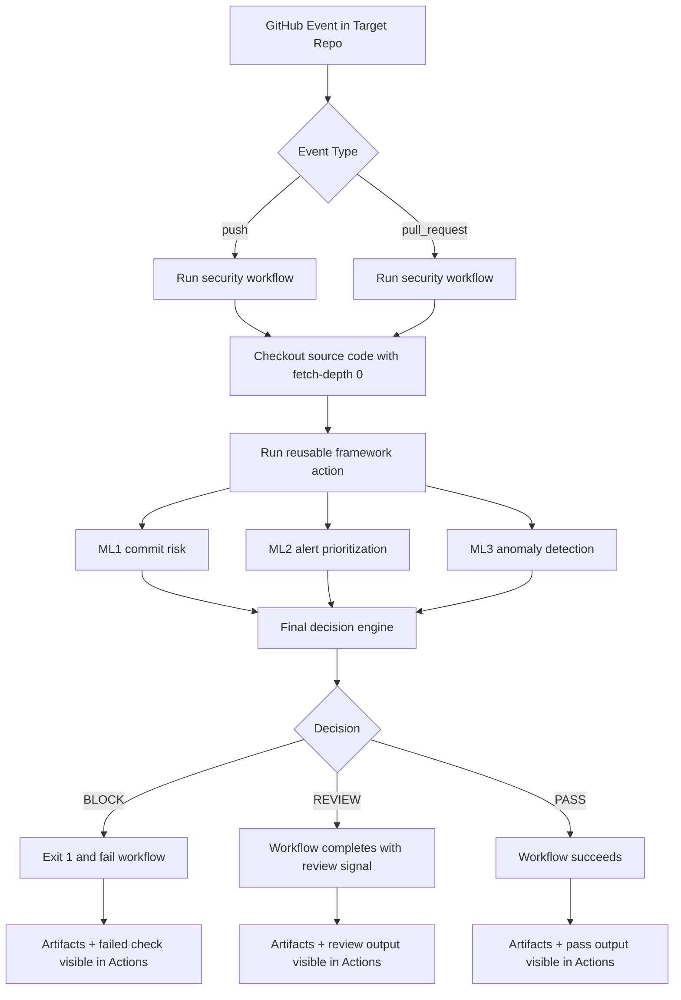
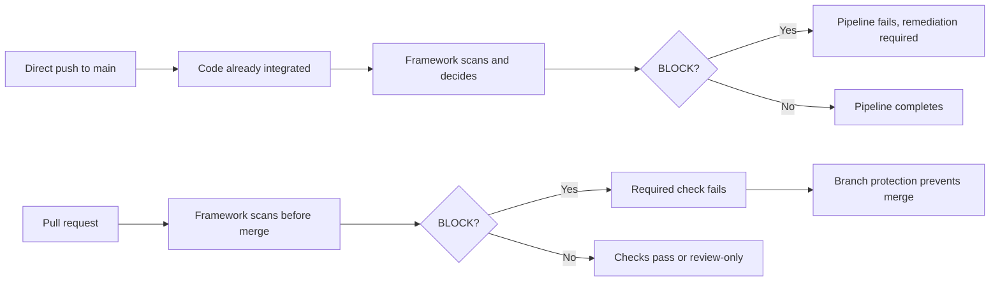

# GitHub Integration Overview

This framework is a reusable GitHub Action that performs automated DevSecOps checks for C/C++ projects using:

- ML1: commit risk prediction
- ML2: static-analysis alert prioritization
- ML3: pipeline anomaly detection
- final decision engine: BLOCK, REVIEW, or PASS

## Purpose and Security Model

This integration supports two complementary governance modes:

1. Reactive detection on direct pushes to main.
2. Preventive enforcement on pull requests before merge.

This is useful for academic and production-style evaluations because it demonstrates both post-integration detection and pre-integration policy gating.

## Where Trigger Logic Lives

Trigger rules are defined in the target repository workflow, not inside this framework repository.

Typical event triggers:

- push to main
- pull_request
- optional workflow_dispatch for manual runs

The target workflow calls this framework with:

```yaml
uses: mrossmaree/ai-driven-devsecops-framework@main
```

## End-to-End Execution Sequence

1. A GitHub event occurs in the target repository.
2. The target workflow starts on a GitHub-hosted runner.
3. Source code is checked out.
4. This framework action runs and performs:
    - Cppcheck and Clang static analysis
    - ML1 commit risk inference
    - ML2 alert prioritization
    - ML3 metrics collection, training, anomaly detection
    - final security decision
5. Reports are generated under reports.
6. Artifacts are uploaded to the workflow run.
7. If final decision is BLOCK, the action exits with non-zero code and the job fails.

## Visual Flow



## Push and PR Behavior

### Direct Push to Main (Reactive)

- The commit has already been integrated.
- The workflow evaluates security posture after integration.
- If decision is BLOCK, the pipeline fails and signals non-compliance.
- The framework does not auto-revert code.

### Pull Request (Preventive)

- The workflow evaluates proposed changes before merge.
- If decision is BLOCK, the check fails.
- With branch protection requiring the check, merge is prevented.

### Push vs PR Governance Flow



## Decision Outcomes and Their Effect

- BLOCK:
   - workflow fails
   - strong policy violation signal
- REVIEW:
   - workflow completes, but indicates manual review required
   - does not block by itself unless repository policy enforces it
- PASS:
   - workflow succeeds

## ML1 Diff Behavior in GitHub Actions

ML1 uses git diff logic to analyze changed C/C++ code only.

Diff strategy:

1. For pull requests, base and head SHAs are used.
2. For push events, ML1 falls back to HEAD~1...HEAD.

Important implications:

- Full history improves reliability for diff-based analysis.
- Use checkout with fetch-depth: 0.
- On very first commits (no parent), ML1 may skip diff-based analysis.

## Required Target Repository Settings

1. GitHub Actions enabled.
2. Branch protection enabled for preventive PR gating.
3. Required status check set to the security workflow job.
4. Workflow permissions:
    - contents: write if ML3 persistence is enabled.
5. Checkout depth:
    - fetch-depth: 0 recommended.

## Framework Inputs (with Defaults)

- scan-path: .
- ml1-high-threshold: 70
- ml1-medium-threshold: 40
- ml1-review-confidence-threshold: 0.2
- ml3-min-rows: 30

## Generated Outputs

### Reports Generated in Workspace

- reports/commit_risk/commit_risk_report.csv
- reports/commit_risk/commit_risk_summary.csv
- reports/alert_prioritizer/cppcheck/prioritised-alerts.csv
- reports/alert_prioritizer/clang/prioritised-alerts.csv
- reports/anomaly_detection/pipeline_metrics.csv
- reports/anomaly_detection/anomaly_report.csv
- reports/anomaly_detection/anomaly_model_comparison.csv
- reports/final_decision/security_decision.csv

### Artifacts Uploaded by Workflow

- cppcheck-xml-report
- clang-console-output
- clang-static-analyzer-report
- commit-risk-report
- commit-risk-summary-report
- cppcheck-prioritised-alerts
- clang-prioritised-alerts
- anomaly-detection-metrics
- ml3-anomaly-report
- ml3-model-comparison
- final-security-decision

## Failure Conditions and What They Mean

- Final decision BLOCK:
   - workflow fails intentionally
- Tool execution warnings (for example, no C/C++ files):
   - workflow may continue with empty or low-signal outputs
- Missing or insufficient git history:
   - ML1 diff behavior can degrade or skip

## Troubleshooting Quick Guide

### Workflow did not trigger

- Verify event triggers in target workflow.
- Verify file path filters include modified file types.

### PR was not blocked

- Confirm final decision was BLOCK, not REVIEW.
- Confirm branch protection requires the workflow check.

### ML1 seems skipped on push

- Ensure checkout uses fetch-depth: 0.
- Ensure the branch has enough history for HEAD~1.

### ML3 persistence step failed

- Confirm workflow permission includes contents: write.
- Confirm event is push and branch is not main.

## Recommended Adoption Sequence

1. Start with workflow_dispatch and pull_request in a test repository.
2. Verify artifacts and security_decision output.
3. Enable branch protection required checks.
4. Add push-to-main trigger for reactive monitoring.
5. Tune thresholds using observed false-positive and false-negative patterns.

## Template Workflow

Use this starter workflow template:

- [doc/Github/template/run-ai-devsecops-security-scan.yml](doc/Github/template/run-ai-devsecops-security-scan.yml)

## Related ML1 Documentation

- [doc/ML1/ML1-OVERVIEW.md](doc/ML1/ML1-OVERVIEW.md)
- [doc/ML1/ML1-guide.md](doc/ML1/ML1-guide.md)
