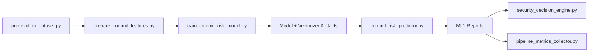
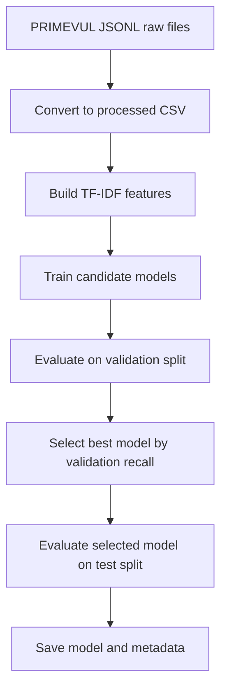
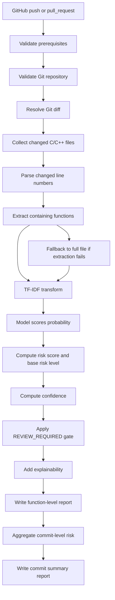

# ML1 Overview

ML1 is the commit-risk model in this framework. It predicts security risk for changed C/C++ functions and aggregates those function-level predictions into a commit-level risk decision.

## Why ML1 Is Function-Centric

The training dataset is PRIMEVUL and the model input is function-level code (`function_code`).

Because of that, runtime analysis is designed as:

commit or PR diff -> changed files -> changed lines -> containing functions -> ML prediction per function -> commit-level aggregation

This keeps runtime inference aligned with the model's training granularity.

## ML1 Scope

- Language scope: C/C++ file extensions
- Supported extensions: `.c`, `.cpp`, `.cc`, `.cxx`, `.h`, `.hpp`
- Excluded runtime directories: `.git`, `reports`, `.devsecops`

## ML1 Code File Structure

This section summarises the responsibility of each ML1 file so the full ML1 design can be understood without reading source code line by line.

### ML1 Source Tree

```text
ml/
  commit_risk/
    primevul_to_dataset.py
    prepare_commit_features.py
    train_commit_risk_model.py
    commit_risk_predictor.py
```

### File-by-File Responsibilities

1. `primevul_to_dataset.py`
- Converts raw PRIMEVUL JSONL files into ML-ready CSV splits.
- Produces normalized columns such as function code and target label.
- Handles dataset cleanup steps (missing rows and duplicates).
- Output role: offline dataset preparation.

2. `prepare_commit_features.py`
- Builds the TF-IDF vectorizer using training split function code.
- Transforms train/validation/test splits into sparse feature matrices.
- Persists vectorizer and feature-label artifacts to disk.
- Output role: offline feature engineering artifacts for training/inference consistency.

3. `train_commit_risk_model.py`
- Trains multiple candidate classifiers.
- Evaluates each model on validation metrics and timing.
- Selects best model by validation recall.
- Evaluates selected model on test split.
- Saves deployable model and metadata.
- Output role: offline model selection and model packaging.

4. `commit_risk_predictor.py`
- Runs in CI/CD at runtime.
- Detects changed C/C++ files and changed lines using git diff logic.
- Extracts changed functions (with full-file fallback when needed).
- Vectorizes function code and predicts risk.
- Applies confidence gating and REVIEW_REQUIRED logic.
- Generates detailed function-level and commit-level reports.
- Output role: online inference and reporting during GitHub workflow execution.

### Supporting Integration Files (Outside ml/commit_risk)

These files consume ML1 outputs or orchestrate ML1 execution in pipeline context:

1. `action.yml`
- Exposes ML1 runtime inputs (thresholds, scan path).
- Invokes `commit_risk_predictor.py` from GitHub Actions.
- Uploads ML1 report artifacts.

2. `ml/decision_engine/security_decision_engine.py`
- Consumes ML1 report risk levels.
- Integrates ML1 with ML2/ML3 signals.
- Produces final BLOCK/REVIEW/PASS decision.

3. `ml/anomaly_detection/pipeline_metrics_collector.py`
- Reads ML1 outputs as part of ML3 metric collection.
- Uses commit risk counts and changed file totals for anomaly features.

### Lifecycle View by File Role



### Quick Examiner Summary

- Offline ML1 build path:
  - `primevul_to_dataset.py` -> `prepare_commit_features.py` -> `train_commit_risk_model.py`
- Online ML1 runtime path:
  - `commit_risk_predictor.py` (invoked by `action.yml`)
- ML1 output consumers:
  - `security_decision_engine.py` and `pipeline_metrics_collector.py`

## Offline Model Development Pipeline

ML1 runtime inference depends on assets produced offline before deployment. The offline pipeline transforms PRIMEVUL data into features, trains candidate models, selects the best model, and saves deployment artifacts.



### Offline Step 1: Dataset conversion

Script:

- `ml/commit_risk/primevul_to_dataset.py`

Inputs:

- `data/raw/commit_risk/primevul_train.jsonl`
- `data/raw/commit_risk/primevul_valid.jsonl`
- `data/raw/commit_risk/primevul_test.jsonl`

Processing:

- converts JSONL records to tabular CSV format
- maps function source to `function_code`
- maps label to `target`
- drops nulls and duplicate functions

Outputs:

- `data/processed/commit_risk/train.csv`
- `data/processed/commit_risk/valid.csv`
- `data/processed/commit_risk/test.csv`

### Offline Step 2: Feature extraction

Script:

- `ml/commit_risk/prepare_commit_features.py`

Processing:

- trains TF-IDF vectorizer on train `function_code`
- applies same vectorizer to validation and test splits
- persists sparse matrices and labels

Outputs:

- `models/commit_risk/tfidf_vectorizer.pkl`
- `data/features/commit_risk/X_train.pkl`
- `data/features/commit_risk/X_valid.pkl`
- `data/features/commit_risk/X_test.pkl`
- `data/features/commit_risk/y_train.pkl`
- `data/features/commit_risk/y_valid.pkl`
- `data/features/commit_risk/y_test.pkl`

### Offline Step 3: Model training and selection

Script:

- `ml/commit_risk/train_commit_risk_model.py`

Candidate models:

- Logistic Regression
- SVM (LinearSVC)
- Random Forest
- ANN (MLPClassifier)

Evaluation metrics recorded:

- accuracy
- precision
- recall
- f1_score
- roc_auc
- training_time
- inference_time
- selected

Model selection logic:

- choose model with highest validation recall
- mark selected model in comparison report
- run final test evaluation for selected model

Outputs:

- `models/commit_risk/commit_risk_model.pkl`
- `models/commit_risk/model_metadata.json`
- `reports/commit_risk/validation_model_comparison.csv`
- `reports/commit_risk/test_evaluation.csv`

### Offline-to-online handoff

The runtime predictor (`ml/commit_risk/commit_risk_predictor.py`) consumes:

- `models/commit_risk/commit_risk_model.pkl`
- `models/commit_risk/tfidf_vectorizer.pkl`

Without these offline artifacts, ML1 inference cannot run.

## End-to-End ML1 Flow



## Runtime Logic Details

### 1) Diff range resolution

ML1 resolves diff range in this order:

1. If `base_ref` and `head_ref` are provided and valid: `base_ref...head_ref`
2. Else fallback: `HEAD~1...HEAD`
3. Else runtime fails with FAILED outcome

If no changed C/C++ files are found, ML1 writes skipped outputs and exits successfully.
If diff range resolution fails, ML1 reports FAILED and exits non-zero.

### 2) Changed file detection

ML1 calls `git diff --name-only <range>` and then filters to:

- supported extensions
- files under `scan-path`
- files not under excluded directories

### 3) Changed line extraction

ML1 parses diff hunk headers (`@@ -a,b +c,d @@`) and records changed line numbers on the new side.

### 4) Function extraction

For each changed file, ML1 extracts function spans and keeps only functions overlapping changed lines.

If no function can be extracted for a changed file:

- fallback record is created
- `function_name` is set to `__FILE_FALLBACK__`
- full file content is analyzed as model input
- explainability reason states fallback was used

### 5) Feature and model inference

ML1 loads:

- model from `models/commit_risk/commit_risk_model.pkl`
- vectorizer from `models/commit_risk/tfidf_vectorizer.pkl`

Then transforms code with TF-IDF and predicts positive-class probabilities.

### 6) Risk score and base level

Risk score:

- `risk_score = probability * 100`

Base risk level:

- HIGH if `risk_score >= high_threshold`
- MEDIUM if `risk_score >= medium_threshold`
- LOW otherwise

### 7) Confidence and REVIEW_REQUIRED

Confidence is calculated as distance from 0.5:

- `confidence = abs(probability - 0.5) * 2`

Decision rule:

- if `confidence < review_confidence_threshold` and base level is not HIGH:
  - risk level becomes `REVIEW_REQUIRED`

This means uncertain LOW/MEDIUM outputs are explicitly flagged for manual review, while HIGH remains HIGH.

### 8) Explainability

ML1 adds two explainability fields:

- `top_risky_terms`: top matched terms from a curated risky token list
- `risk_reason`: human-readable explanation including:
  - risk category
  - confidence threshold reason when REVIEW_REQUIRED
  - fallback reason when full-file fallback is used

### 9) Commit-level aggregation

Commit risk level precedence:

1. HIGH
2. REVIEW_REQUIRED
3. MEDIUM
4. LOW
5. SKIPPED

This ensures one severe function can raise commit-level risk.

## ML1 Output Reports

### Function-level output

Path:

- `reports/commit_risk/commit_risk_report.csv`

Columns:

- commit metadata: `commit_sha`, `branch`, `event_type`, `author`, `base_ref`, `head_ref`
- location: `file_path`, `function_name`, `start_line`, `end_line`
- scoring: `risk_score`, `risk_level`, `confidence`, `review_confidence_threshold`
- explainability: `top_risky_terms`, `risk_reason`
- runtime metrics: `vectorization_time_ms`, `model_inference_time_ms`, `total_prediction_runtime_ms`

### Commit-level summary output

Path:

- `reports/commit_risk/commit_risk_summary.csv`

Columns:

- commit metadata: `commit_sha`, `branch`, `event_type`, `author`, `base_ref`, `head_ref`
- counters: `total_changed_files`, `total_changed_functions`
- risk counts: `high_risk_functions`, `review_required_functions`, `medium_risk_functions`, `low_risk_functions`
- score/decision: `max_risk_score`, `commit_risk_level`, `status`, `reason`
- runtime metrics: `vectorization_time_ms`, `model_inference_time_ms`, `total_prediction_runtime_ms`

Report generation behaviour:

- COMPLETED: both `commit_risk_report.csv` and `commit_risk_summary.csv` are generated
- SKIPPED: both `commit_risk_report.csv` and `commit_risk_summary.csv` are generated
- FAILED: execution exits non-zero

## Runtime Inputs

ML1 runtime arguments:

- `--scan-path`
- `--model-path`
- `--vectorizer-path`
- `--high-threshold`
- `--medium-threshold`
- `--review-confidence-threshold`
- `--commit-sha`
- `--branch`
- `--event-type`
- `--author`
- `--base-ref`
- `--head-ref`
- `--output`
- `--summary-output`

In GitHub Actions, these are passed by the composite action from workflow inputs and GitHub context.

## Failure and Skip Behavior

- No C/C++ changes: ML1 writes skip-style outputs with `commit_risk_level=SKIPPED` and summary `status/reason`.
- Changed files but no analyzable functions: ML1 writes skip-style outputs with `commit_risk_level=SKIPPED` and summary `status/reason`.
- Function extraction failure for a file: ML1 falls back to full-file analysis for that file.
- Startup validation failures (invalid scan path, invalid Git repository, missing or unreadable model/vectorizer): ML1 reports FAILED and exits non-zero.
- Git execution failures or unresolved diff ranges are treated as FAILED rather than SKIPPED.
- Invalid thresholds:
  - medium threshold must be less than high threshold
  - review confidence threshold must be between 0 and 1

## Reliability and Error Handling

ML1 reliability checks now explicitly validate:

- scan path exists and is a directory
- execution context is a Git working tree
- trained model file exists and loads successfully
- TF-IDF vectorizer file exists and loads successfully

Git command failures are surfaced as FAILED outcomes and are not silently treated as empty change sets.

## Integration with Final Decision Engine

The decision engine consumes ML1 report risk levels and applies gating:

- HIGH can lead to BLOCK
- REVIEW_REQUIRED leads to REVIEW
- MEDIUM can lead to REVIEW
- LOW contributes to PASS if no higher-priority signals exist

## Performance Signals

ML1 reports:

- vectorization time
- model inference time
- total prediction runtime

These are useful for CI tuning and scalability analysis.

## Evaluation Notes

During model evaluation in training, ROC-AUC can be unavailable for some label distributions. When that occurs, it is reported as unavailable rather than recorded as `0.0`.

## Limitations to Keep in Mind

- Function extraction is heuristic and may miss edge-case syntax patterns.
- First commit or shallow git history can reduce diff reliability.
- Explainability tokens are term-based, not full model-attribution methods.

## Related Files

- `ml/commit_risk/primevul_to_dataset.py`
- `ml/commit_risk/prepare_commit_features.py`
- `ml/commit_risk/train_commit_risk_model.py`
- `ml/commit_risk/commit_risk_predictor.py`
- `action.yml`
- `ml/decision_engine/security_decision_engine.py`
