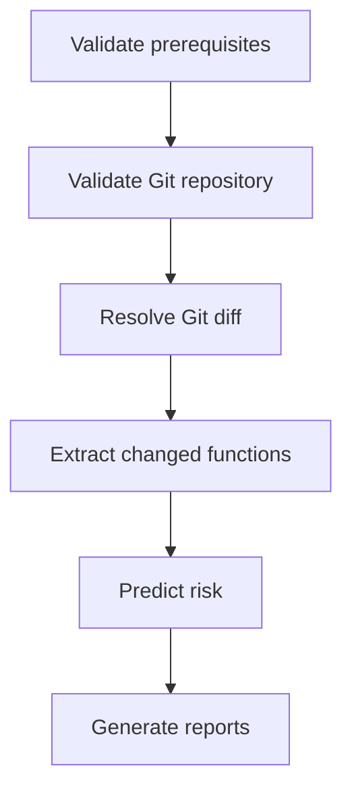

# ML1 Guide

This guide explains what to run, in what order, and how to validate ML1 end-to-end.

## What ML1 Does

ML1 predicts risk for changed C/C++ functions in a commit or pull request and produces:

ML1 can be described as commit-aware function-level vulnerability risk prediction.

- function-level report
- commit-level summary report

## Prerequisites

- Python 3 available
- Dependencies installed: `pandas`, `scikit-learn`, `joblib`, `numpy`
- PRIMEVUL raw files present:
  - `data/raw/commit_risk/primevul_train.jsonl`
  - `data/raw/commit_risk/primevul_valid.jsonl`
  - `data/raw/commit_risk/primevul_test.jsonl`

## Training Pipeline (Offline)

Run these scripts in order from repository root.

### Step 1: Convert PRIMEVUL JSONL to CSV

```bash
python3 ml/commit_risk/primevul_to_dataset.py
```

Expected outputs:

- `data/processed/commit_risk/train.csv`
- `data/processed/commit_risk/valid.csv`
- `data/processed/commit_risk/test.csv`

### Step 2: Build TF-IDF Features

```bash
python3 ml/commit_risk/prepare_commit_features.py
```

Expected outputs:

- `models/commit_risk/tfidf_vectorizer.pkl`
- `data/features/commit_risk/X_train.pkl`
- `data/features/commit_risk/X_valid.pkl`
- `data/features/commit_risk/X_test.pkl`
- `data/features/commit_risk/y_train.pkl`
- `data/features/commit_risk/y_valid.pkl`
- `data/features/commit_risk/y_test.pkl`

### Step 3: Train and Select Model

```bash
python3 ml/commit_risk/train_commit_risk_model.py
```

Expected outputs:

- `models/commit_risk/commit_risk_model.pkl`
- `models/commit_risk/model_metadata.json`
- `reports/commit_risk/validation_model_comparison.csv`
- `reports/commit_risk/test_evaluation.csv`

Selection logic:

- Trains Logistic Regression, SVM, Random Forest, ANN
- Selects best model by highest validation recall
- Writes model comparison evidence including timing and AUC

## Runtime Inference (Local CLI)

Run ML1 predictor on current repo changes.

```bash
python3 ml/commit_risk/commit_risk_predictor.py \
  --scan-path "." \
  --model-path "models/commit_risk/commit_risk_model.pkl" \
  --vectorizer-path "models/commit_risk/tfidf_vectorizer.pkl" \
  --high-threshold "70" \
  --medium-threshold "40" \
  --review-confidence-threshold "0.2" \
  --output "reports/commit_risk/commit_risk_report.csv" \
  --summary-output "reports/commit_risk/commit_risk_summary.csv"
```

Optional metadata args for non-GitHub local runs:

- `--commit-sha`
- `--branch`
- `--event-type`
- `--author`
- `--base-ref`
- `--head-ref`

## Runtime Execution Outcomes

ML1 runtime now has three explicit outcomes:

### COMPLETED

- Prediction completed successfully.
- Both reports are generated:
  - `reports/commit_risk/commit_risk_report.csv`
  - `reports/commit_risk/commit_risk_summary.csv`

### SKIPPED

- No changed C/C++ files were detected, or
- Changed C/C++ files were found but no analyzable functions were extracted.
- Both reports are still generated.
- Summary includes skip context in `status` and `reason`.

### FAILED

- Invalid Git repository (not inside a Git working tree).
- Git diff range could not be resolved.
- Invalid scan path (missing path or not a directory).
- Missing or unreadable model file.
- Missing or unreadable TF-IDF vectorizer file.
- ML1 exits with a non-zero exit code.

## Runtime Workflow

Current runtime workflow:



## Runtime Inference in GitHub Actions

Use the framework action in target repo workflow:

```yaml
- name: Run AI DevSecOps Framework
  uses: mrossmaree/ai-driven-devsecops-framework@main
  with:
    scan-path: "."
    ml1-high-threshold: "70"
    ml1-medium-threshold: "40"
    ml1-review-confidence-threshold: "0.2"
```

Important checkout setting:

```yaml
- uses: actions/checkout@v4
  with:
    fetch-depth: 0
```

## ML1 Input Parameters

Action-level inputs (from `action.yml`):

- `scan-path`
- `ml1-high-threshold`
- `ml1-medium-threshold`
- `ml1-review-confidence-threshold`

Predictor-level core args:

- `--model-path`
- `--vectorizer-path`
- `--output`
- `--summary-output`

## How to Read ML1 Output

ML1 generates two runtime outputs:

- `reports/commit_risk/commit_risk_report.csv`
- `reports/commit_risk/commit_risk_summary.csv`

For both COMPLETED and SKIPPED outcomes, both files are produced.

### commit_risk_report.csv

Each row represents one analyzed function (or fallback file record):

- `risk_score`: 0 to 100
- `risk_level`: HIGH, REVIEW_REQUIRED, MEDIUM, LOW
- `confidence`: model confidence derived from probability distance to 0.5
- `top_risky_terms`: matched high-risk lexical indicators
- `risk_reason`: explanation text

Sample row:

```csv
commit_sha,branch,event_type,author,base_ref,head_ref,file_path,function_name,start_line,end_line,risk_score,risk_level,confidence,review_confidence_threshold,top_risky_terms,risk_reason,vectorization_time_ms,model_inference_time_ms,total_prediction_runtime_ms
7c2f11a,feature/login-hardening,pull_request,mishel,3de210f,7c2f11a,src/auth/login.c,validate_credentials,41,97,63.4,REVIEW_REQUIRED,0.18,0.2,strcpy|buffer|malloc,REVIEW_REQUIRED because model confidence (0.18) is below threshold (0.2). Potential risky terms include strcpy, buffer, malloc.,12.8,4.2,38.7
```

### commit_risk_summary.csv

Single-row summary per run:

- changed file/function counts
- counts by risk category
- max score
- final `commit_risk_level`
- execution `status`
- execution `reason`
- runtime metrics

`status` and `reason` indicate whether execution was COMPLETED or SKIPPED, and why.

## Decision Semantics

Function-level to commit-level precedence:

1. HIGH
2. REVIEW_REQUIRED
3. MEDIUM
4. LOW
5. SKIPPED

Interpretation:

- Any HIGH function elevates commit to HIGH.
- If no HIGH but at least one low-confidence function, commit is REVIEW_REQUIRED.

## Validation Checklist

1. Run safe C/C++ change and confirm LOW or PASS-oriented output.
2. Run known vulnerable pattern change and confirm HIGH appears.
3. Run ambiguous change and check REVIEW_REQUIRED behavior.
4. Confirm reports are produced even when no C/C++ changes (SKIPPED summary).

## Common Issues and Fixes

## Reliability and Error Handling

ML1 now enforces startup and runtime validation before prediction:

- validates `scan-path` exists and is a directory
- validates execution is inside a Git working tree
- validates trained model file exists and is readable
- validates TF-IDF vectorizer file exists and is readable
- treats Git command failures as FAILED (not SKIPPED)

When these checks fail, ML1 reports a FAILED outcome and exits non-zero.

### ML1 says no C/C++ changes detected

- Check trigger path filters.
- Check `scan-path`.
- Ensure git history is available (`fetch-depth: 0`).

### Predictor fails with threshold error

- Ensure medium threshold is less than high threshold.
- Ensure review confidence threshold is within [0, 1].

### No model/vectorizer found

- Run training pipeline steps first.
- Verify paths in predictor arguments.

## Evaluation Notes

During model evaluation, ROC-AUC may be unavailable for specific splits (for example, single-class target distributions). In that case, ML1 records ROC-AUC as unavailable instead of writing a misleading `0.0`.

### PR behavior differs from push behavior

- PR uses base/head refs.
- Push often uses HEAD~1...HEAD fallback.
- Ensure sufficient git history exists on runner.

## Suggested Operational Defaults

- `ml1-high-threshold`: 70
- `ml1-medium-threshold`: 40
- `ml1-review-confidence-threshold`: 0.2

A threshold of 0.2 means predictions close to 50% probability are treated as uncertain and marked REVIEW_REQUIRED.

Tune these using your validation results and false positive tolerance.

## Related Documents

- [doc/ML1/ML1-OVERVIEW.md](doc/ML1/ML1-OVERVIEW.md)
- [doc/Github/OVERVIEW.md](doc/Github/OVERVIEW.md)
- [doc/Github/Github-guide.md](doc/Github/Github-guide.md)
