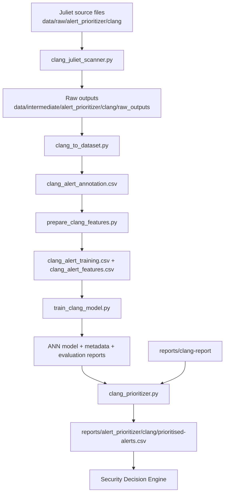
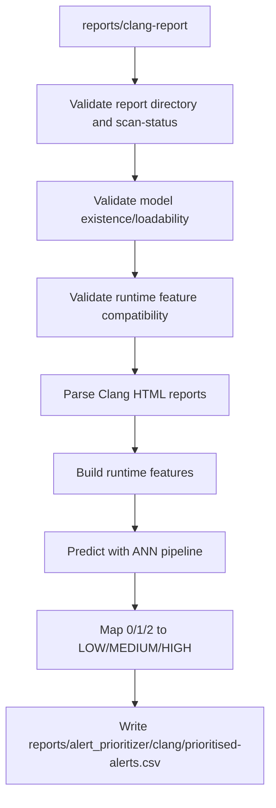

# ML2 Clang Guide

This guide explains what ML2 Clang does, how it is trained, how runtime prioritisation works, and how to validate it end-to-end based on the current committed implementation.

## What ML2 Clang Does

ML2 Clang prioritises Clang Static Analyzer findings into operational priority levels (LOW, MEDIUM, HIGH) so security triage can focus first on the most consequential findings.

Within the AI-Driven DevSecOps Framework:

- ML1 scores commit-level code risk (commit_risk_report.csv).
- ML2 scores SAST alert priority (prioritised-alerts.csv for Cppcheck and Clang).
- ML3 models pipeline anomalies from historical run metrics.
- The Security Decision Engine combines ML1, ML2, and ML3 outputs to produce BLOCK, REVIEW, or PASS.

For Clang specifically:

- Training data generation starts from Juliet C/C++ testcases under data/raw/alert_prioritizer/clang/.
- Expanded Clang scan artifacts are generated under data/intermediate/alert_prioritizer/clang/raw_outputs/.
- Runtime prioritisation consumes reports/clang-report/ and writes reports/alert_prioritizer/clang/prioritised-alerts.csv.

Final deployed model:

- The final deployed ML2 Clang model is ANN 64.
- The deployed model artifact is models/alert_prioritizer/clang/clang_priority_model.pkl.

## Complete Architecture



## Data Lifecycle

Raw Juliet source dataset:

- data/raw/alert_prioritizer/clang/

Generated intermediate Clang scan outputs:

- data/intermediate/alert_prioritizer/clang/raw_outputs/
  - report text files (.txt)
  - analyzer plist files (.plist)

Processed ML2 Clang files:

- data/processed/alert_prioritizer/clang/clang_alert_annotation.csv
- data/processed/alert_prioritizer/clang/clang_alert_training.csv
- data/processed/alert_prioritizer/clang/clang_alert_features.csv

## Expanded Juliet Scanning

Script:

- ml/alert_prioritizer/clang/clang_juliet_scanner.py

Committed scanning design:

- Five CWE families are selected:
  - CWE121_Stack_Based_Buffer_Overflow
  - CWE122_Heap_Based_Buffer_Overflow
  - CWE415_Double_Free
  - CWE416_Use_After_Free
  - CWE476_NULL_Pointer_Dereference
- Case selection is deterministic with fixed seed 42.
- Selection is performed by complete-case grouping, where companion files are grouped by Juliet case ID.
- Up to approximately 200 complete cases per CWE are sampled where available.

Why complete-case grouping matters:

- Companion files for the same Juliet case are retained together.
- This avoids partial-case sampling noise and improves consistency for downstream annotation and grouped evaluation.

## Annotation and Ground Truth

Script:

- ml/alert_prioritizer/clang/clang_to_dataset.py

Committed annotation behaviour:

1. Parse scanner text outputs and candidate source locations.
2. Match text findings to plist diagnostics using normalized:
- source paths
- line numbers
- diagnostic message text
3. Recover source_function from plist issue_context when available.
4. If source_function is unavailable, use enclosing-function fallback from source code context.
5. Infer Juliet good/bad path from explicit function naming:
- bad / badSink / badSource variants
- good / goodG2B / goodB2G variants
- numbered variants are supported (for example goodG2B1, goodB2G2).
6. Retain unknown records for auditability.

Ground-truth constraints:

- Labels are not derived from Clang severity, alert message, alert ID, or checker ID.
- Ground truth is inferred from Juliet path semantics (good/bad) and associated Juliet CWE family.

## Final Annotation Results

Committed final annotation totals:

- Deduplicated alerts: 11,449
- Unique Juliet case IDs: 4,584
- good: 6,665
- bad: 4,508
- unknown: 276

Unknown handling:

- Unknown records are retained in annotation/training feature files for audit transparency.
- Unknown records are excluded from model training and evaluation.

## Priority Labeling

Script:

- ml/alert_prioritizer/clang/prepare_clang_features.py

Committed label mapping:

- LOW: Juliet good path
- MEDIUM: Juliet bad path from CWE476_NULL_Pointer_Dereference
- HIGH: Juliet bad path from:
  - CWE121_Stack_Based_Buffer_Overflow
  - CWE122_Heap_Based_Buffer_Overflow
  - CWE415_Double_Free
  - CWE416_Use_After_Free
- UNKNOWN: everything else

Numeric encoding:

- LOW = 0
- MEDIUM = 1
- HIGH = 2
- UNKNOWN excluded from model training/evaluation

Final distribution:

- LOW: 6,665
- MEDIUM: 244
- HIGH: 4,264
- UNKNOWN: 276

Target integrity statement:

- The target is derived from independent Juliet ground truth plus Juliet CWE family.
- Juliet-only fields are excluded from runtime model inputs.

## Runtime Model Features

Committed model feature columns:

- severity_score
- has_cwe
- is_null_pointer
- is_buffer_issue
- is_memory_issue
- is_obsolete_function
- is_clang
- alert_id
- severity
- message

Fields excluded from model inputs:

- Juliet identifiers and supervision fields (for example juliet_case_id, juliet_cwe_family, ground_truth_status)
- Target fields (priority, label)
- Audit/provenance fields (annotation_id, source_file, raw_report_path, manual_priority, annotation_reason)

## Training and Evaluation Methodology

Script:

- ml/alert_prioritizer/clang/train_clang_model.py

Committed methodology:

1. Exclude UNKNOWN from supervised training set.
2. Deduplicate with label-aware key:
- juliet_case_id, source_file, line, alert_id, severity, message, label
3. Grouped split by juliet_case_id using deterministic seed 42.
4. Effective split ratio is 60/20/20:
- outer split: 80/20 train_val/test
- inner split: 75/25 train/validation on train_val
5. Enforce no case overlap across train/validation/test.
6. Enforce no exact duplicate-overlap across splits.
7. Perform model selection using validation split only.
8. Evaluate selected model once on untouched test split.

Current split summary:

- Train: 6,729 rows, 2,624 case groups
- Validation: 2,145 rows, 875 case groups
- Test: 2,299 rows, 875 case groups
- Overlap checks: all zero (group and exact-duplicate)

## Candidate Models

The training script evaluates the following candidate configurations:

- Logistic Regression with `C = 0.1`
- Logistic Regression with `C = 1`
- Logistic Regression with `C = 10`
- Linear SVM (`LinearSVC`) with `C = 0.1` and `max_iter = 10000`
- Linear SVM (`LinearSVC`) with `C = 1` and `max_iter = 10000`
- Linear SVM (`LinearSVC`) with `C = 10` and `max_iter = 10000`
- Random Forest constrained configuration
- Random Forest unrestricted configuration
- ANN with hidden layer sizes `(64,)`
- ANN with hidden layer sizes `(128, 64)`
- ANN with hidden layer sizes `(128, 64)` and stronger regularisation

Selection criteria:

1. Validation HIGH recall must be at least `0.60` for eligibility.
2. Primary ranking metric: Macro F1.
3. Secondary ranking metric: HIGH recall.
4. Tie-breaker: lowest HIGH-to-LOW misclassification count.
5. Further tie-breakers: Weighted F1, then Accuracy.

## Final Model and Results

Selected model:

- ANN 64

Final test metrics:

- Accuracy: 0.802522836015659
- Macro F1: 0.6970778493290114
- Weighted F1: 0.7933647490688439
- HIGH recall: 0.5860091743119266
- HIGH precision: 0.9076376554174067
- HIGH F1: 0.7121951219512195

Interpretation:

- HIGH predictions are precise (high precision), so predicted HIGH alerts are usually correct.
- HIGH recall is lower, meaning some true HIGH alerts are still missed.

MEDIUM class limitation:

- Total MEDIUM examples: 244
- Test support for MEDIUM: 47
- MEDIUM F1 on test: approximately 0.525

## Reproducibility Artifacts

Core artifacts:

- models/alert_prioritizer/clang/clang_priority_model.pkl
- models/alert_prioritizer/clang/model_metadata.json
- reports/alert_prioritizer/clang/validation_model_comparison.csv
- reports/alert_prioritizer/clang/test_evaluation.csv

These artifacts preserve:

- model identity and parameters
- feature schema
- split strategy and seed
- overlap checks
- validation model comparison evidence
- final untouched test metrics

## Runtime Pipeline

Runtime script:

- ml/alert_prioritizer/clang/clang_prioritizer.py

Runtime flow:



Runtime output:

- reports/alert_prioritizer/clang/prioritised-alerts.csv
- output columns are preserved as:
  - priority, tool, file, line, alert_id, cwe, severity, message

## Runtime Outcomes

Committed explicit runtime outcomes:

### COMPLETED WITH ALERTS

Conditions:

- Valid Clang reports exist.
- Alerts are parsed.
- Model loads and feature compatibility validation passes.
- Prediction succeeds.
- prioritised-alerts.csv is generated with rows.

### COMPLETED WITH ZERO ALERTS

Conditions:

- Clang scan completed successfully.
- Valid report structure exists but no usable alerts are parsed.
- Header-only prioritised-alerts.csv is generated.
- Exit code is 0.

### FAILED

Failure conditions:

- Missing report directory.
- Scan status indicates scanner/analyzer failure.
- Report folder has no valid analyzer outputs after scan attempt.
- Malformed/unreadable report content.
- Missing model file.
- Corrupt/unloadable model.
- Runtime/model feature compatibility mismatch.
- Prediction failure.

Failure handling:

- Clear FAILED message to stderr.
- Explicit non-zero process exit.

## action.yml Clang Scanner Behavior

Clang scan step in action.yml now uses explicit exit handling (no silent masking):

- scan-build exit 0: successful analyzer run with no findings.
- scan-build exit 1 with --status-bugs: findings present; continue workflow.
- scan-build other non-zero: analyzer execution/configuration failure; fail step.

The scanner writes reports/clang-report/scan-status.txt with one of:

- SCAN_COMPLETED_NO_SOURCE
- SCAN_COMPLETED_NO_FINDINGS
- SCAN_COMPLETED_WITH_FINDINGS
- SCAN_FAILED

This marker allows runtime to distinguish:

- scan completed with no source files
- scan completed with no findings
- scan completed with findings
- scan execution failure

## End-to-End Commands

Training-data and model generation (offline):

```bash
python3 ml/alert_prioritizer/clang/clang_juliet_scanner.py
python3 ml/alert_prioritizer/clang/clang_to_dataset.py
python3 ml/alert_prioritizer/clang/prepare_clang_features.py
python3 ml/alert_prioritizer/clang/train_clang_model.py
```

Runtime prioritisation (workflow/local runtime context):

```bash
python3 ml/alert_prioritizer/clang/clang_prioritizer.py
```

## Validation Checklist

1. Confirm scan-status marker exists under reports/clang-report/.
2. Confirm model exists at models/alert_prioritizer/clang/clang_priority_model.pkl.
3. Confirm runtime produces one of the three outcome states.
4. Confirm output file schema is preserved.
5. Confirm failures are explicit and non-zero.

## Runtime Verification Evidence

The following runtime scenarios were verified against the finalized Clang prioritizer.

| Scenario | Expected Behaviour | Observed Behaviour | Status |
|---|---|---|---|
| Missing Clang report directory | Clear failure and non-zero exit | `FAILED` reported with exit code `1` | PASS |
| Valid scan with no source files | Empty prioritized CSV and successful completion | `COMPLETED WITH ZERO ALERTS`, exit code `0` | PASS |
| Valid scan with no findings | Empty prioritized CSV and successful completion | `COMPLETED WITH ZERO ALERTS`, exit code `0` | PASS |
| Scanner failure marker | Clear failure and non-zero exit | `FAILED` reported with exit code `1` | PASS |
| Missing model artifact | Clear model failure and non-zero exit | `FAILED` reported with exit code `1` | PASS |
| Corrupt model artifact | Clear load failure and non-zero exit | `FAILED` reported with exit code `1` | PASS |
| Feature-schema incompatibility | Clear compatibility failure and non-zero exit | `FAILED` reported with exit code `1` | PASS |

The offline pipeline was also rerun from Juliet scanning through model training. The regenerated class distributions, selected ANN model, and final evaluation metrics matched the previous run, providing evidence of deterministic and reproducible execution.

## Limitations

Current implementation limitations:

- Dataset source is synthetic Juliet, not real production repositories.
- Class imbalance remains significant, especially MEDIUM.
- Unknown records are excluded from supervised training/evaluation.
- Domain shift risk exists when moving from Juliet to real-world projects.
- HIGH recall is lower than HIGH precision.
- Runtime parsing depends on expected Clang report formats.

## Future Improvements

Potential next steps aligned with current architecture:

- Expand to additional CWE families.
- Add external real-world validation datasets.
- Improve MEDIUM-class coverage.
- Add probability calibration or confidence reporting.
- Add automated runtime regression tests for outcome semantics.

## Related Documents

- doc/ML2/ML2-CLANG-OVERVIEW.md
- doc/ML2/ML2-CPPHECK-GUIDE.md
- doc/ML1/ML1-guide.md
- doc/Github/Github-guide.md
