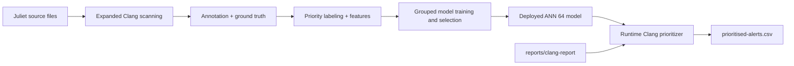
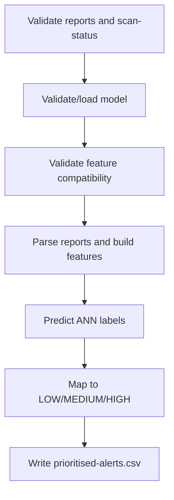

# ML2 Clang Overview

ML2 Clang is the static-analysis alert prioritisation component for Clang Static Analyzer findings in this framework. It converts analyzer findings into operational priorities (LOW, MEDIUM, HIGH) so security triage can focus on the most consequential alerts first.

## Purpose and Framework Role

ML2 Clang addresses high-volume SAST triage by learning a prioritisation model from Juliet-based ground truth and applying it to runtime Clang reports.

Framework role:

- ML1 performs commit-level risk prediction.
- ML2 performs alert-level prioritisation (Cppcheck and Clang).
- ML3 performs pipeline anomaly detection.
- The Security Decision Engine combines ML1, ML2, and ML3 outputs into BLOCK, REVIEW, or PASS.

Final deployed model:

- ANN 64 (artefact: models/alert_prioritizer/clang/clang_priority_model.pkl)

## Architecture Summary

## Data Lifecycle

Raw source:

- data/raw/alert_prioritizer/clang/

Intermediate generated scanner artifacts:

- data/intermediate/alert_prioritizer/clang/raw_outputs/

Processed outputs:

- data/processed/alert_prioritizer/clang/clang_alert_annotation.csv
- data/processed/alert_prioritizer/clang/clang_alert_training.csv
- data/processed/alert_prioritizer/clang/clang_alert_features.csv

## Expanded Juliet Scanning Design

Committed scanner behaviour:

- CWE families: CWE121, CWE122, CWE415, CWE416, CWE476.
- Deterministic complete-case grouping by Juliet case ID.
- Companion files retained per grouped case.
- Fixed seed: 42.
- Approximately 200 complete cases per CWE where available.

## Annotation and Ground Truth Strategy

Committed annotation behaviour includes:

- matching text reports to plist diagnostics
- normalized path, line, and diagnostic-message matching
- source_function recovery from plist issue_context
- enclosing-function fallback when source_function is not available
- explicit good/bad Juliet function naming rules with numbered variants (for example goodG2B1, goodB2G2)
- unknown records retained for audit

Ground-truth independence:

- No labels are derived from Clang severity, alert message, alert ID, or checker ID.
- Targets are derived from Juliet good/bad semantics and Juliet CWE family.

## Final Annotation and Label Totals

Final annotation results:

- deduplicated alerts: 11,449
- unique Juliet case IDs: 4,584
- good: 6,665
- bad: 4,508
- unknown: 276

Priority labeling:

- LOW: Juliet good path
- MEDIUM: Juliet bad path from CWE476
- HIGH: Juliet bad path from CWE121/CWE122/CWE415/CWE416
- numeric mapping: LOW=0, MEDIUM=1, HIGH=2
- UNKNOWN excluded from supervised training/evaluation

Final distribution:

- LOW: 6,665
- MEDIUM: 244
- HIGH: 4,264
- UNKNOWN: 276

## Runtime Feature Schema

Model feature columns:

- severity_score
- has_cwe
- is_null_pointer
- is_buffer_issue
- is_memory_issue
- is_obsolete_function
- is_clang
- alert_id
- severity
- message

Excluded from model inputs:

- Juliet identifiers and ground-truth fields
- target labels
- audit/provenance fields

This separation keeps training target derivation independent while preventing runtime leakage of Juliet-only supervision fields.

## Evaluation Methodology

Committed methodology:

- deduplication before split
- grouped split by juliet_case_id
- deterministic seed 42
- 60/20/20 train/validation/test
- no case overlap across splits
- no exact duplicate overlap across splits
- model selection on validation only
- untouched final test evaluation

Candidate model configurations:

- Logistic Regression with `C = 0.1`
- Logistic Regression with `C = 1`
- Logistic Regression with `C = 10`
- Linear SVM (`LinearSVC`) with `C = 0.1` and `max_iter = 10000`
- Linear SVM (`LinearSVC`) with `C = 1` and `max_iter = 10000`
- Linear SVM (`LinearSVC`) with `C = 10` and `max_iter = 10000`
- Random Forest constrained configuration
- Random Forest unrestricted configuration
- ANN with hidden layer sizes `(64,)`
- ANN with hidden layer sizes `(128, 64)`
- ANN with hidden layer sizes `(128, 64)` and stronger regularisation

Selection strategy:

1. Eligibility threshold: validation HIGH recall must be at least `0.60`.
2. Primary ranking metric: Macro F1.
3. Secondary ranking metric: HIGH recall.
4. Tie-breaker: lowest HIGH-to-LOW misclassification count.
5. Further tie-breakers: Weighted F1, then Accuracy.

## Final Model and Performance

Selected model:

- ANN 64

Final test metrics:

- Accuracy: 0.802522836015659
- Macro F1: 0.6970778493290114
- Weighted F1: 0.7933647490688439
- HIGH recall: 0.5860091743119266
- HIGH precision: 0.9076376554174067
- HIGH F1: 0.7121951219512195

Interpretation:

- HIGH predictions are precise (high precision).
- Some HIGH alerts are still missed (lower HIGH recall).

MEDIUM class limitation:

- total MEDIUM examples: 244
- test support: 47
- MEDIUM F1: approximately 0.525

## Reproducibility Artifacts

- models/alert_prioritizer/clang/clang_priority_model.pkl
- models/alert_prioritizer/clang/model_metadata.json
- reports/alert_prioritizer/clang/validation_model_comparison.csv
- reports/alert_prioritizer/clang/test_evaluation.csv

These artifacts preserve model identity, split integrity evidence, selection rationale, and final test performance.

## Runtime Pipeline and Outcomes

Runtime input/output:

- input: reports/clang-report/
- output: reports/alert_prioritizer/clang/prioritised-alerts.csv

Runtime process:

- Clang report validation
- scan-status marker interpretation
- model validation/load
- feature compatibility validation
- prediction validation
- LOW/MEDIUM/HIGH mapping and CSV output

Committed runtime outcomes:

- COMPLETED WITH ALERTS
- COMPLETED WITH ZERO ALERTS
- FAILED

Failure handling is explicit and non-zero for missing/invalid reports, scanner failure marker, model failure, feature mismatch, and prediction failure.

## action.yml Clang Behavior

Committed Clang scanner orchestration behaviour:

- scan-build exit 0: successful scan
- scan-build exit 1 with --status-bugs: findings present, continue
- other non-zero exits: analyzer execution failure

scan-status marker values in reports/clang-report/scan-status.txt:

- SCAN_COMPLETED_NO_SOURCE
- SCAN_COMPLETED_NO_FINDINGS
- SCAN_COMPLETED_WITH_FINDINGS
- SCAN_FAILED

This marker allows runtime to distinguish no-source, no-findings, findings, and scanner failure states.

## Limitations

- synthetic Juliet source distribution
- class imbalance, especially MEDIUM
- unknown records excluded from supervised training/evaluation
- domain shift risk for real projects
- HIGH recall lower than HIGH precision
- runtime dependency on expected Clang report formats

## Future Improvements

- extend to additional CWE families
- external real-world validation
- increase MEDIUM-class coverage
- add probability calibration or confidence reporting
- add automated runtime regression tests

## Contribution Summary

ML2 Clang contributes alert-level prioritisation to the framework by combining Juliet-grounded labeling, leakage-controlled grouped evaluation, and hardened runtime outcome semantics, then integrating directly with GitHub Actions and the Security Decision Engine.
