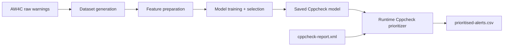
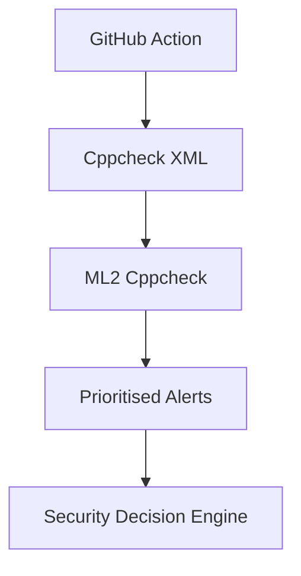
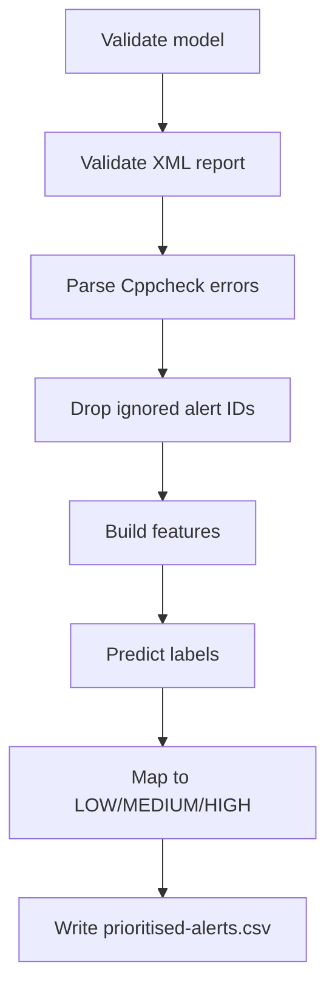

# ML2 Cppcheck Overview

ML2 Cppcheck is the static-analysis alert prioritisation component for Cppcheck findings in this framework. It converts raw SAST warnings into operational priorities (`LOW`, `MEDIUM`, `HIGH`) so security teams can triage findings in a risk-informed order.

## Purpose

ML2 Cppcheck addresses a practical CI/CD problem: static analyzers can produce large warning volumes, but not all warnings should receive equal operational urgency. The component learns a priority mapping from AW4C-derived data and applies it at runtime to Cppcheck XML outputs.

In the final committed implementation, the deployed model is `RandomForest`, selected via the validation-based model selection strategy and stored at `models/alert_prioritizer/cppcheck/alert_priority_model.pkl`.

The final implementation also uses grouped train/validation/test splitting by source file, with explicit no-overlap checks for both source files and duplicate alert identities across splits. This design improves evaluation quality by reducing train/evaluation information leakage.

## ML2 Architecture

## Dataset

Source and preparation:

- AW4C actionable and non-actionable warning archives are read from `data/raw/alert_prioritizer/cppcheck/`.
- Priority labels are generated using the committed rules (`LOW`, `MEDIUM`, `HIGH` -> `0`, `1`, `2`).
- Exact duplicates are removed using alert identity fields: tool, file, line, alert ID, CWE, severity, message, actionable flag, priority, and label.
- Final dataset is saved to `data/processed/alert_prioritizer/cppcheck/aw4c_alert_dataset.csv`.

Final dataset counts:

- Rows before deduplication: `76,273`
- Rows after deduplication: `69,450`
- Duplicate rows removed: `6,823`

## Features

The current model uses:

- Numeric/binary: `severity_score`, `has_cwe`, `is_null_pointer`, `is_buffer_issue`, `is_memory_issue`, `is_obsolete_function`, `is_cppcheck`
- Categorical/text: `alert_id`, `severity`, `cwe`, `message`

Training preprocessor:

- `StandardScaler` for numeric features
- `OneHotEncoder` for categorical fields
- `TfidfVectorizer(max_features=3000, ngram_range=(1,2))` for message text

## Training Pipeline

Training script: `ml/alert_prioritizer/cppcheck/train_cppcheck_model.py`

Pipeline stages:

1. Load and deduplicate dataset.
2. Build grouped train/validation/test split by source file (`GroupShuffleSplit`).
3. Search deterministic split candidates to keep class distribution close to full dataset.
4. Enforce integrity checks:
- no source-file overlap across splits
- no exact duplicate identity rows across splits
- all priority classes present in all splits
5. Train candidate models on train split.
6. Evaluate candidates on validation split.
7. Select final model.
8. Evaluate selected model once on untouched test split.
9. Persist model, metrics, and metadata.

## Validation Strategy

Model selection strategy is explicitly multi-criterion:

- Primary: `Macro_F1`
- Secondary: `HIGH_Recall`
- Tie-breakers: `Weighted_F1`, then `Accuracy`

This strategy balances class-level fairness with sensitivity to high-priority security findings.

## Final Selected Model

In the current committed metadata, the selected Cppcheck model is `RandomForest`.

Saved artifacts:

- `models/alert_prioritizer/cppcheck/alert_priority_model.pkl`
- `models/alert_prioritizer/cppcheck/model_metadata.json`
- `reports/alert_prioritizer/cppcheck/validation_model_comparison.csv`
- `reports/alert_prioritizer/cppcheck/test_evaluation.csv`

## Reproducibility

The final ML2 Cppcheck component preserves the core reproducibility artifacts:

- trained model
- model metadata
- validation evaluation report
- final test evaluation report

In particular, `models/alert_prioritizer/cppcheck/model_metadata.json` records split strategy, seed, overlap checks, selected model, and artifact paths required for reproducible audit.

## Framework Position

## Runtime Pipeline

Runtime script: `ml/alert_prioritizer/cppcheck/cppcheck_prioritizer.py`

Ignored IDs are preserved as:

- `checkersReport`
- `missingIncludeSystem`
- `missingInclude`

## Runtime Validation

The current runtime implementation validates:

- report existence
- report non-empty state
- XML parse validity
- model existence
- model loadability
- required feature column presence
- prediction execution success

Failures produce `FAILED: ...` on stderr and non-zero exit.

## Outputs

Runtime output:

- `reports/alert_prioritizer/cppcheck/prioritised-alerts.csv`

Columns:

- `priority`, `tool`, `file`, `line`, `alert_id`, `cwe`, `severity`, `message`

Outcome semantics implemented:

- `COMPLETED WITH ALERTS`
- `COMPLETED WITH ZERO ALERTS`
- `FAILED`

## Integration with the AI-Driven DevSecOps Framework

Framework integration is orchestrated in `action.yml`:

1. Cppcheck scan generates `reports/cppcheck-report.xml`.
2. ML2 Cppcheck prioritizer consumes that report.
3. Security Decision Engine consumes ML2 outputs alongside ML1 and ML3.
4. ML3 pipeline metrics collector uses ML2 alert counts for anomaly features.

## Contribution

ML2 Cppcheck provides the framework’s alert-level prioritisation layer. It complements ML1 commit-risk modeling by converting analyzer findings into ordered operational priorities and contributes directly to unified final security decision-making.

## Limitations

- Label creation is rule-based from AW4C metadata rather than manual ground-truth triage decisions.
- Runtime output currently reports priority classes without explicit confidence values.
- Robustness depends on expected Cppcheck XML structure.

## Summary

ML2 Cppcheck is implemented as an end-to-end alert prioritisation workflow with reproducible training artifacts, validation-led model selection, and robust runtime outcome semantics.

