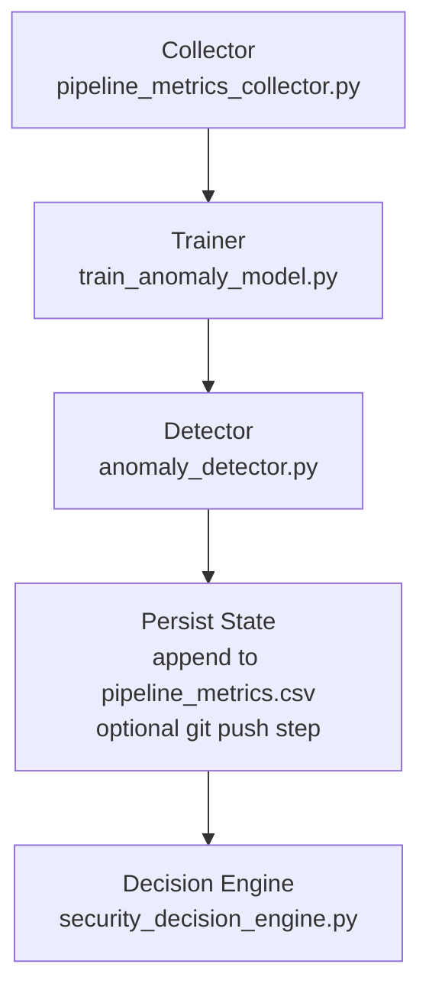

# ML3 User Guide

## Purpose

ML3 detects abnormal CI/CD pipeline behaviour for the current repository by learning from repository-local historical metrics. It does not rely on hard-coded global thresholds. It derives pipeline-level features from ML1 and ML2 outputs, trains or refreshes an anomaly model, scores the current run, and feeds the result into the Security Decision Engine.

## Folder Structure

Repository paths relevant to ML3 are shown below.

```text
ml/
  anomaly_detection/
    pipeline_metrics_collector.py
    train_anomaly_model.py
    anomaly_detector.py
  decision_engine/
    security_decision_engine.py

action.yml
.gitignore

reports/
  anomaly_detection/
    .gitkeep

# Created at runtime by action and ML3 scripts
.devsecops/
  anomaly_detection/
    pipeline_metrics.csv
    models/
      anomaly_model.pkl
      anomaly_scaler.pkl
      anomaly_model_metadata.json
```

## Runtime Files

Core runtime inputs and outputs:

- reports/commit_risk/commit_risk_report.csv: ML1 row-level risk output consumed by collector.
- reports/commit_risk/commit_risk_summary.csv: ML1 aggregate file count source for total_files_scanned.
- reports/alert_prioritizer/cppcheck/prioritised-alerts.csv: ML2 Cppcheck priority output consumed by collector.
- reports/alert_prioritizer/clang/prioritised-alerts.csv: ML2 Clang priority output consumed by collector.
- reports/anomaly_detection/current_pipeline_metrics.csv: single current-run metrics row produced by collector.
- .devsecops/anomaly_detection/pipeline_metrics.csv: historical ML3 state used for training and updated by detector.
- .devsecops/anomaly_detection/models/anomaly_model.pkl: selected deployable anomaly model.
- .devsecops/anomaly_detection/models/anomaly_scaler.pkl: scaler fitted on final training data.
- .devsecops/anomaly_detection/models/anomaly_model_metadata.json: feature schema, selection metrics, hashes, environment/version metadata.
- reports/anomaly_detection/anomaly_report.csv: ML3 scoring result and state outcome.
- reports/anomaly_detection/anomaly_model_comparison.csv: training summary and model comparison output.
- reports/anomaly_detection/synthetic_evaluation.csv: synthetic labeled evaluation for deployable models and exploratory LOF record.
- reports/anomaly_detection/synthetic_evaluation_summary.json: concise synthetic evaluation summary.

## How ML3 Executes

End-to-end ML3 runtime order in the GitHub action:

1. pipeline_metrics_collector.py collects current metrics from ML1/ML2 reports and writes current_pipeline_metrics.csv.
2. train_anomaly_model.py reads historical state and either trains/updates model artifacts or writes SKIPPED/FAILED training reports.
3. anomaly_detector.py loads current metrics, performs gating/validation, executes inference when possible, writes anomaly_report.csv, and appends current row to history when allowed.
4. Optional persistence step commits .devsecops/anomaly_detection state back to the branch when ml3-persist-state is true and workflow conditions match.
5. security_decision_engine.py consumes anomaly_report.csv with ML1/ML2 outputs and issues final decision.

### Persistence condition and default template behavior

The persistence step in `action.yml` is gated by all of the following:

- `github.event_name == 'push'`
- `github.ref_name != 'main'`
- `inputs.ml3-persist-state == 'true'`

With the default consuming workflow template (`push` scoped to `main`, plus
`pull_request` to `main` and `workflow_dispatch`), this condition is not
normally reached automatically.

Practical implication for the frozen implementation:

- default behavior is no automatic ML3 state commit/push back;
- persistence requires an intentionally different non-main push workflow design;
- PR runs remain safe from ML3 state write-back.

## Training

### History

Training reads only .devsecops/anomaly_detection/pipeline_metrics.csv.

The current run row is not included during training because collector writes current metrics to reports, not directly to history.

### Minimum rows

Minimum rows are controlled by ML3_MIN_ROWS, defaulting to 30. Invalid or non-positive values fall back to 30.

If valid historical rows are below the minimum, training is skipped and status artifacts are still written.

### Training

Training pipeline details:

1. Load history and enforce feature columns.
2. Filter valid rows by excluding:
- rows where ml3_scoring_blocked is true
- rows with upstream status values MISSING, MALFORMED, or SCHEMA_MISMATCH
- rows with ml3_outcome/anomaly_status equal to FAILED
3. Split valid rows into train and holdout (holdout ratio approximately 20%, at least one row).
4. Generate synthetic anomalies deterministically from holdout rows using seed 42 and fixed perturbation recipe.
5. Evaluate deployable candidates on labeled normal-plus-synthetic set:
- Isolation Forest
- One-Class SVM
6. Evaluate LOF in-sample for exploratory analysis only (not deployable).
7. Select best deployable model by ordered criteria:
- f1 descending
- recall descending
- false_positive_rate ascending
- execution_time_seconds ascending
8. Retrain selected model on all valid rows.
9. Save model and scaler.

### Model selection

LOF is not deployment eligible. It appears in reports for exploratory comparison only with an explicit reason that novelty=False cannot safely score unseen rows in runtime.

### Metadata

anomaly_model_metadata.json includes:

- selected_model
- selection_policy and selection_metrics
- feature_columns
- row counts (total/valid/excluded)
- exclusion_reasons
- history timestamp range
- training_data_hash
- random seed and perturbation recipe
- model hyperparameters
- Python/pandas/scikit-learn/joblib versions
- artifact paths and model version timestamp

## Detection

### Current metrics

Detector requires reports/anomaly_detection/current_pipeline_metrics.csv with exactly one row.

Failure conditions include missing file, malformed CSV, empty file, or row count not equal to 1.

### Validation

Detector validates in order:

1. current metrics availability and single-row shape
2. scoring-block flags from collector
3. model/scaler/metadata artifact existence
4. metadata readability
5. feature schema compatibility with metadata feature_columns
6. numeric convertibility of all feature values
7. model/scaler loadability
8. inference execution

### Loading model

If model artifacts are absent:

- reason is INSUFFICIENT_HISTORY when history_rows_before_append < ML3_MIN_ROWS
- otherwise reason is MODEL_NOT_TRAINED

In both cases anomaly_status is NOT_AVAILABLE and report is still written.

### Prediction

When validation passes:

- features are scaled with anomaly_scaler.pkl
- model predicts inlier/outlier
- anomaly_status maps to NORMAL or ANOMALOUS
- anomaly_score is decision_function output when available
- selected_model is read from metadata

### Writing report

Detector always writes reports/anomaly_detection/anomaly_report.csv, including:

- anomaly_status
- is_anomaly
- anomaly_score
- selected_model
- reason
- failure_reason
- ml3_scoring_blocked
- ml3_scoring_block_reason
- history_rows_before_append
- current_run_appended

For successful scoring, feature values are also copied into the report row.

### History append

After report generation, detector may append the current row once to history with outcome fields:

- ml3_outcome
- ml3_reason
- ml3_failure_reason

Append is skipped for certain hard failures (for example schema incompatibility, model/scaler load failure, metadata load failure, inference failure).

## Decision Engine

ML3 influences final security decision as follows:

- anomaly_status ANOMALOUS -> REVIEW
- anomaly_status FAILED -> REVIEW
- anomaly_status NOT_AVAILABLE -> REVIEW only when anomaly_reason indicates malformed/schema-incompatible unavailability
- anomaly_status NORMAL -> no escalation by ML3

ML3 does not directly produce BLOCK; BLOCK is triggered by ML1 HIGH or ML2 HIGH findings.

## Generated Reports

ML3 report semantics:

- reports/anomaly_detection/current_pipeline_metrics.csv: collector output for current run only.
- reports/anomaly_detection/anomaly_report.csv: detector runtime outcome used by decision engine.
- reports/anomaly_detection/anomaly_model_comparison.csv: training status plus evaluated model rows.
- reports/anomaly_detection/synthetic_evaluation.csv: synthetic labeled evaluation details and LOF exploratory row.
- reports/anomaly_detection/synthetic_evaluation_summary.json: compact summary with selected model and perturbation recipe.

State file:

- .devsecops/anomaly_detection/pipeline_metrics.csv: cumulative runtime history used for future training.

## History Behaviour

### Current row

Current run metrics are first written to current_pipeline_metrics.csv and scored before any append attempt.

### History

Persistent history is append-based and stored in .devsecops/anomaly_detection/pipeline_metrics.csv.

### Duplicate prevention

append_current_row_once prevents duplicate appends using stable identifiers:

1. ml3_run_id match when history has ml3_run_id
2. fallback github_run_id match when ml3_run_id is unavailable

### Blocked rows

Rows can be marked with ml3_scoring_blocked=true when upstream reports are missing, malformed, or schema-mismatched. These rows are written and can be appended, but are later excluded from training.

### Valid rows

Training-valid rows are those that are not blocked, have valid upstream statuses, and are not FAILED ML3 outcomes.

## Cold Start

Cold start occurs when history is absent or insufficient.

Observed behaviour:

- Training writes SKIPPED status artifacts.
- Detector reports NOT_AVAILABLE with reason INSUFFICIENT_HISTORY (or MODEL_NOT_TRAINED when row threshold is met but artifacts are absent).
- Current row is still eligible for append, allowing history to accumulate for later training.
- Decision outcome then depends on ML1/ML2 unless malformed/schema-specific NOT_AVAILABLE rules trigger REVIEW.

## Common Runtime Scenarios

### 1) Normal run

- Upstream reports parse successfully.
- Model artifacts exist and schema matches.
- Detector outputs anomaly_status NORMAL.
- Decision engine may return PASS if no ML1/ML2 escalation exists.

### 2) Anomaly

- Detector predicts outlier and sets anomaly_status ANOMALOUS.
- Decision engine returns REVIEW with anomalous pipeline reason.

### 3) Missing reports

- Collector marks missing upstream report status as MISSING.
- ml3_scoring_blocked is set true with detailed block reason.
- Detector returns NOT_AVAILABLE and appends state.

### 4) Malformed reports

- Collector marks malformed upstream report status as MALFORMED.
- Scoring is blocked; detector outputs NOT_AVAILABLE.
- Decision engine escalates malformed/schema-related unavailability to REVIEW.

### 5) Model unavailable

- Detector cannot find model/scaler/metadata artifacts.
- Returns NOT_AVAILABLE with INSUFFICIENT_HISTORY or MODEL_NOT_TRAINED.
- This does not automatically force REVIEW by ML3 alone.

### 6) Failed runtime

Examples:

- metadata load failure
- current metrics schema incompatible with metadata feature list
- non-numeric feature values
- model/scaler load failure
- inference exception

Result:

- anomaly_status FAILED
- failure_reason populated
- decision engine escalates to REVIEW

### 7) Duplicate execution

- Same run ID is seen again.
- append_current_row_once detects duplicate and skips append.
- anomaly report sets current_run_appended to false.

## Troubleshooting

1. Verify collector output exists and has exactly one row in reports/anomaly_detection/current_pipeline_metrics.csv.
2. Check anomaly_status, reason, and failure_reason in reports/anomaly_detection/anomaly_report.csv.
3. Inspect upstream status columns in current_pipeline_metrics.csv:
- commit_risk_status
- commit_summary_status
- cppcheck_status
- clang_status
4. Confirm model artifacts exist under .devsecops/anomaly_detection/models.
5. Validate metadata feature_columns against current metrics columns.
6. Check numeric formatting of all nine feature columns.
7. Review training outputs:
- reports/anomaly_detection/anomaly_model_comparison.csv
- reports/anomaly_detection/synthetic_evaluation.csv
- reports/anomaly_detection/synthetic_evaluation_summary.json
8. If training is repeatedly skipped, check valid row counts versus ML3_MIN_ROWS and inspect exclusion_reasons in metadata once a model is produced.
9. If history does not grow, verify duplicate run identifiers and CSV readability of .devsecops/anomaly_detection/pipeline_metrics.csv.

## Runtime Validation

The final implementation was validated using representative operational scenarios.

- Cold start
- Insufficient history
- Normal scoring
- Blocked upstream reports
- Malformed reports
- Missing required features
- Corrupt model artifacts
- Corrupt metadata
- Duplicate execution
- Self-inclusion prevention
- Training history filtering
- Decision Engine integration

## Repository Notes

Current repository hygiene behaviour:

- reports/** is ignored by default in .gitignore.
- reports/.gitkeep and selected evaluation artifacts for ML1/ML2 are explicitly unignored.
- reports/anomaly_detection keeps directory structure via .gitkeep; runtime ML3 outputs are generated during runs.

Operational guidance for generated artifacts:

- .devsecops contains runtime state and model artifacts generated per consuming repository.
- reports runtime outputs are generated artifacts.
- data/raw, data/intermediate, data/processed, and data/features are ignored as generated/training data paths in this repository.

When ml3-persist-state is enabled in action inputs and workflow conditions are met, .devsecops/anomaly_detection state is intentionally committed and pushed by the action for longitudinal ML3 history. Under the default workflow template, those conditions are not usually met automatically.

## Final Workflow Diagram



---

Version: 1.0
Status: Frozen Implementation
Component: ML3 Pipeline Anomaly Detection
