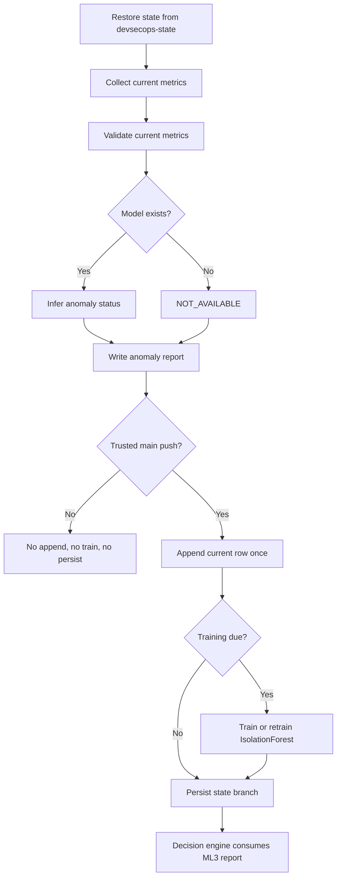

# ML3 Overview

ML3 provides repository-specific CI/CD pipeline anomaly detection using trusted historical metrics from each consuming repository.

## Core Design

- No shared pre-trained ML3 model is distributed.
- Each consuming repository maintains its own baseline in `devsecops-state`.
- Only trusted main-push executions update shared history.
- Inference always occurs before append and before retraining.
- Production uses IsolationForest only (`random_state=42`).
- No separate scaler artifact is used.

## Trusted History Model

Trusted updates require:

- push event
- `refs/heads/main`
- qualifying C/C++ change
- valid current metrics

PR/manual/feature-branch runs are read-only for shared state.

## Lifecycle



## Bootstrap and Retraining

- Records 1-29: append trusted rows only, `NOT_AVAILABLE`.
- Record 30: append then initial train, still `NOT_AVAILABLE`.
- Record 31: first scored execution.
- Retraining defaults: every 20 trusted rows (50, 70, 90, ...).

## State Files

```text
.devsecops/anomaly_detection/pipeline_metrics.csv
.devsecops/anomaly_detection/models/anomaly_model.pkl
.devsecops/anomaly_detection/models/anomaly_model_metadata.json
```

## Statuses

- `NORMAL`
- `ANOMALOUS`
- `NOT_AVAILABLE`
- `FAILED`
