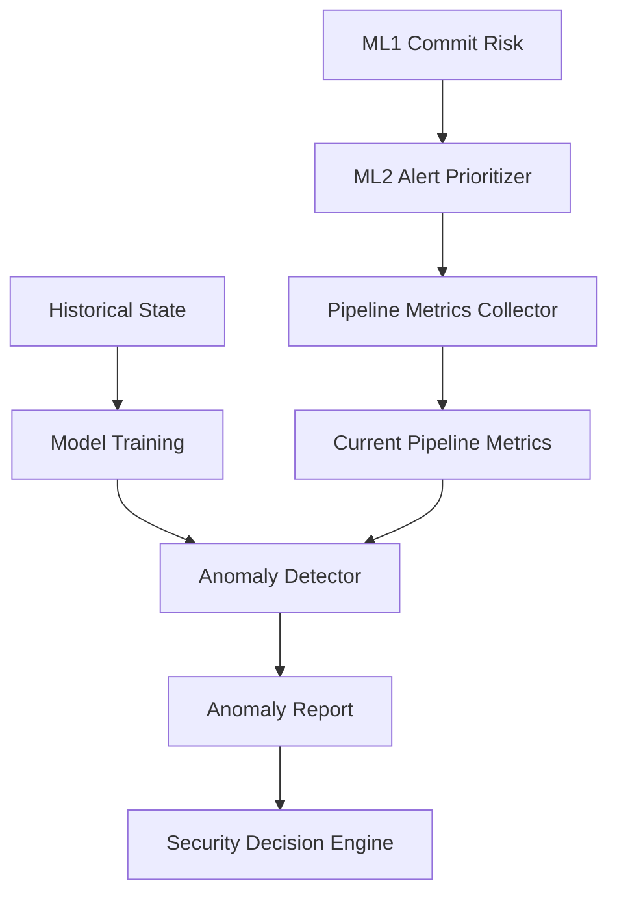

# ML3 - Pipeline Anomaly Detection

## Why ML3?

Traditional security gates evaluate only the findings produced in the current run. ML3 complements ML1 and ML2 by learning repository-specific CI/CD behavioural patterns over time, allowing the framework to identify unusual pipeline executions even when individual code-level findings appear normal. In this role, ML3 contributes behavioural anomaly detection rather than source-code analysis.

## Purpose

ML3 detects abnormal CI/CD pipeline behaviour using repository-specific historical metrics rather than fixed, rule-based thresholds.

Unlike ML1 and ML2, ML3 does not inspect source code or individual static-analysis findings directly. It analyses pipeline-level behaviour signals aggregated from upstream outputs (commit risk and alert-prioritisation results) to determine whether the current run is statistically consistent with this repository's normal historical pattern.

Inside the AI-driven DevSecOps Framework, this provides a drift and outlier signal that can surface unusual operational conditions even when point-wise findings are low.

## Position inside the framework

ML3 executes after ML1 and ML2 have produced their reports, and before the final security gate decision.

ML1 -> ML2 -> ML3 -> Security Decision Engine

- ML1 provides commit-level risk outputs.
- ML2 provides prioritised static-analysis alerts.
- ML3 converts those outputs into pipeline metrics, trains or refreshes anomaly models from historical state, and scores the current run.
- The Security Decision Engine consumes ML1, ML2, and ML3 outputs to emit BLOCK, REVIEW, or PASS.

## Runtime Workflow

Exact execution order in the action pipeline:

1. Collect pipeline metrics.
2. Train or update anomaly model from historical state.
3. Detect anomaly using current metrics.
4. Persist historical state (optional, gated by workflow inputs and branch/event conditions).
5. Run Security Decision Engine.

Persistence gate in `action.yml` requires:

- `push` event
- non-main branch (`github.ref_name != 'main'`)
- `ml3-persist-state == true`

With the default consuming template (`push` on `main`, `pull_request` to
`main`, plus `workflow_dispatch`), automatic ML3 state write-back is not
normally reached unless a separate non-main push persistence workflow is
intentionally designed.

Important design detail: the current run metrics are generated first but are not appended to historical state until anomaly detection finalisation. This prevents self-inclusion of the row being scored.

## Assumptions

- ML1 completes successfully.
- ML2 completes successfully.
- Required reports are generated.
- Current pipeline metrics can be collected.
- Historical repository state is available when persistence is enabled.
- Runtime artifacts are accessible.

## Input

ML3 runtime consumes four input groups.

### Current metrics

Produced by:

- reports/anomaly_detection/current_pipeline_metrics.csv

Generated from upstream reports:

- reports/commit_risk/commit_risk_report.csv
- reports/commit_risk/commit_risk_summary.csv
- reports/alert_prioritizer/cppcheck/prioritised-alerts.csv
- reports/alert_prioritizer/clang/prioritised-alerts.csv

### Historical state

Repository-local state file:

- .devsecops/anomaly_detection/pipeline_metrics.csv

This file is used for training and is updated by the detector after report finalisation (append-once semantics).

### Models

Runtime model artifacts:

- .devsecops/anomaly_detection/models/anomaly_model.pkl
- .devsecops/anomaly_detection/models/anomaly_scaler.pkl

### Metadata

Runtime metadata artifact:

- .devsecops/anomaly_detection/models/anomaly_model_metadata.json

Metadata drives runtime feature compatibility checks and records model provenance, training hash, selection metrics, environment versions, and evaluation artifact pointers.

## Features Used

The current implementation uses exactly nine numerical features:

1. total_files_scanned: number of changed files from ML1 summary when available; otherwise fallback to commit-risk row count.
2. total_alerts: sum of HIGH, MEDIUM, and LOW alerts from combined ML2 Cppcheck and Clang outputs.
3. high_alerts: count of HIGH-priority alerts.
4. medium_alerts: count of MEDIUM-priority alerts.
5. low_alerts: count of LOW-priority alerts.
6. high_commit_risk: count of ML1 HIGH risk entries.
7. medium_commit_risk: count of ML1 MEDIUM risk entries.
8. low_commit_risk: count of ML1 LOW risk entries.
9. alerts_per_file: total_alerts / total_files_scanned, rounded to two decimals (0 if denominator is zero).

Operational (non-feature) state columns are also tracked and persisted, including upstream status fields and ML3 scoring-block indicators.

## Machine Learning Approach

ML3 trains and evaluates unsupervised anomaly methods over repository history.

### Candidate models

- Isolation Forest
- One-Class SVM
- Local Outlier Factor (LOF)

### Deployability policy

- Isolation Forest and One-Class SVM are deployable.
- LOF is exploratory only in this implementation (configured with novelty=False), so it is not eligible for deployment and is excluded from runtime scoring selection.

### Synthetic anomaly evaluation

Because repository history is unlabeled, ML3 performs deterministic synthetic evaluation:

- Holdout set is the most recent approximately 20% of valid historical rows.
- Synthetic anomalies are generated from holdout rows using seeded perturbations with RANDOM_SEED=42.
- Perturbations modify alert volume, high-alert/high-risk counts, alerts_per_file, and total_files_scanned according to fixed recipe ranges.
- Evaluation labels are constructed as normal holdout rows (0) plus synthetic anomaly rows (1).

### Final model selection

Deployable candidates are ranked by:

1. anomaly F1 (descending)
2. anomaly recall (descending)
3. false positive rate (ascending)
4. execution time (ascending)

Best-ranked model is retrained on all valid historical rows and persisted with scaler and metadata.

### Why repository history is used

The model baseline is repository-specific. Behaviour is learned from this repository's own historical CI/CD patterns rather than external threshold heuristics, allowing anomaly decisions to adapt to local normality.

## Current Outputs

The final implementation emits the following ML3 artifacts.

### Runtime metrics and state

- reports/anomaly_detection/current_pipeline_metrics.csv
- .devsecops/anomaly_detection/pipeline_metrics.csv

### Detection output

- reports/anomaly_detection/anomaly_report.csv

### Training and comparison artifacts

- reports/anomaly_detection/anomaly_model_comparison.csv
- reports/anomaly_detection/synthetic_evaluation.csv
- reports/anomaly_detection/synthetic_evaluation_summary.json

### Model artifacts and metadata

- .devsecops/anomaly_detection/models/anomaly_model.pkl
- .devsecops/anomaly_detection/models/anomaly_scaler.pkl
- .devsecops/anomaly_detection/models/anomaly_model_metadata.json

## Runtime States

ML3 anomaly_status values are:

- NORMAL: model loaded successfully and prediction is inlier.
- ANOMALOUS: model loaded successfully and prediction is outlier.
- NOT_AVAILABLE: scoring intentionally unavailable (for example scoring blocked by upstream status or model unavailable).
- FAILED: runtime failure state (for example unreadable current metrics, schema incompatibility, model/scaler load failure, metadata load failure, non-numeric feature values, or inference failure).

## Decision Engine Integration

Security decision integration behaviour:

- ML3 ANOMALOUS forces REVIEW (reason: anomalous CI/CD pipeline behaviour).
- ML3 FAILED forces REVIEW (reason: ML3 runtime failed).
- ML3 NOT_AVAILABLE forces REVIEW only for malformed/schema-incompatible upstream unavailability cases identified by anomaly reason content.
- ML3 NOT_AVAILABLE due cold start (for example INSUFFICIENT_HISTORY or MODEL_NOT_TRAINED) does not automatically force REVIEW; final decision then depends on ML1/ML2 signals.

ML3 never directly produces BLOCK. BLOCK is driven by ML1 HIGH or ML2 HIGH findings.

ML3 contributes an independent behavioural anomaly signal, but it does not override BLOCK decisions produced by ML1 or ML2 criteria. The Security Decision Engine combines outputs from all three ML components before issuing the final PASS, REVIEW, or BLOCK decision.

## Key Design Decisions

The final implementation enforces the following decisions.

- Current-run scoring: current metrics are collected and scored as a single-row batch.
- History-only training: model training uses historical state file rows only.
- No self-inclusion: current row is not appended before scoring.
- Duplicate prevention: append-once logic avoids duplicate history insertion using stable run identifiers.
- Blocked-row handling: if upstream reports are missing, malformed, or schema-mismatched, scoring is blocked with explicit reason and status propagation.
- History filtering: training excludes rows with ML3 scoring blocked, upstream invalid statuses, and previously FAILED ML3 outcomes.
- Stable run IDs: row identity is derived as gh_run:<GITHUB_RUN_ID>, else sha:<GITHUB_SHA>:<timestamp>, else ts:<timestamp>, with detector-side fallback.

## Current Limitations

Only limitations present in the current implementation are listed below.

- Feature scope is intentionally compact and aggregate-only (nine numeric features), so fine-grained contextual signals are not modelled.
- Synthetic anomaly evaluation is perturbation-based and deterministic; there is no external labeled anomaly benchmark.
- LOF is exploratory and excluded from deployable scoring by design.
- The decision engine only escalates NOT_AVAILABLE to REVIEW for malformed/schema-related cases; cold-start unavailability does not by itself trigger manual review.
- If historical state CSV is unreadable during append, the detector preserves existing artifact and skips append (history continuity depends on readable state file).

## Summary

ML3 provides repository-specific CI/CD anomaly detection by learning historical pipeline behaviour from ML1/ML2-derived metrics, selecting a deployable unsupervised model via deterministic synthetic evaluation, scoring each current run without self-inclusion, and propagating clear runtime states to the Security Decision Engine.

---

Version: 1.0
Status: Frozen Implementation
Component: ML3 Pipeline Anomaly Detection