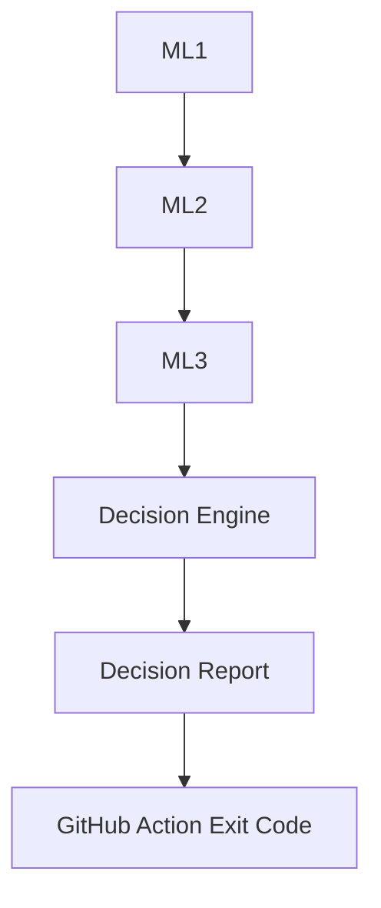

# Decision Engine User Guide

## Purpose

This guide explains how the Security Decision Engine executes in practice, how it consumes ML1, ML2, and ML3 reports, and how it produces the final CI/CD security gate outcome.

The component converts multi-model outputs into one runtime decision:

- BLOCK
- REVIEW
- PASS

## Folder Structure

```text
ml/
  decision_engine/
    security_decision_engine.py

action.yml

reports/
  commit_risk/
    commit_risk_report.csv
  alert_prioritizer/
    cppcheck/
      prioritised-alerts.csv
    clang/
      prioritised-alerts.csv
  anomaly_detection/
    anomaly_report.csv
  final_decision/
    security_decision.csv
```

## Runtime Execution

The runtime sequence is fixed.

### 1) Loading reports

security_decision_engine.py attempts to load:

- reports/commit_risk/commit_risk_report.csv
- reports/alert_prioritizer/cppcheck/prioritised-alerts.csv
- reports/alert_prioritizer/clang/prioritised-alerts.csv
- reports/anomaly_detection/anomaly_report.csv

load_report behaviour:

- missing file -> empty DataFrame and log message
- parse error -> empty DataFrame and log message
- empty CSV -> empty DataFrame and log message

### 2) Summarizing findings

The engine computes:

- ML1 counts by risk_level: HIGH, REVIEW_REQUIRED, MEDIUM, LOW
- ML2 counts by priority across Cppcheck + Clang: HIGH, MEDIUM, LOW
- ML3 summary: anomaly_status, anomaly_score, anomaly_reason

If ML3 report is unavailable, fallback summary is:

- anomaly_status: NOT_AVAILABLE
- anomaly_score: empty
- anomaly_reason: ML3 anomaly report not available

### 3) Decision evaluation

The engine applies ordered rules (first matching rule wins):

1. BLOCK on any ML1 HIGH or ML2 HIGH.
2. REVIEW on ML1 REVIEW_REQUIRED.
3. REVIEW on ML3 ANOMALOUS.
4. REVIEW on ML3 NOT_AVAILABLE only when anomaly_reason indicates malformed/schema-related unavailability.
5. REVIEW on ML3 FAILED.
6. REVIEW on any ML1 MEDIUM or ML2 MEDIUM.
7. PASS otherwise.

### 4) Writing report

The engine writes one-row output:

- reports/final_decision/security_decision.csv

### 5) Workflow completion

Exit code semantics:

- BLOCK -> raises SystemExit(1)
- REVIEW -> returns normally (exit 0)
- PASS -> returns normally (exit 0)

## Decision Logic

### BLOCK

Triggered when at least one condition is true:

- commit_high_count > 0
- alert_high_count > 0

Reason:

- High commit risk or high severity security alerts detected

### REVIEW

Triggered by first matching REVIEW rule after BLOCK:

1. commit_review_required_count > 0
- Reason: Low-confidence ML1 predictions require manual review

2. anomaly_status == ANOMALOUS
- Reason: Anomalous CI/CD pipeline behaviour detected by ML3

3. anomaly_status == NOT_AVAILABLE and anomaly_reason contains one of:
- MISSING
- MALFORMED
- SCHEMA_MISMATCH
- schema-incompatible
- CURRENT_METRICS_SCHEMA_INCOMPATIBLE
- Reason: ML3 anomaly detection unavailable due to malformed or schema-incompatible upstream input

4. anomaly_status == FAILED
- Reason: ML3 anomaly detection runtime failed

5. commit_medium_count > 0 or alert_medium_count > 0
- Reason: Medium commit risk or medium severity security alerts detected

### PASS

Reached only when no BLOCK or REVIEW condition applies.

Reason:

- Only low risk findings detected, if low findings exist.
- No commit risk, security alerts, or anomaly detected, if no low findings exist.

## Reading ML Reports

### ML1 report consumption

Input file:

- reports/commit_risk/commit_risk_report.csv

Consumed fields:

- risk_level for counts and decision rules
- file_path and risk_score for issue summaries

### ML2 report consumption

Input files:

- reports/alert_prioritizer/cppcheck/prioritised-alerts.csv
- reports/alert_prioritizer/clang/prioritised-alerts.csv

Consumed fields:

- priority for counts and decision rules
- tool, file, line, alert_id, message for issue summaries

The two ML2 inputs are concatenated before summarization.

### ML3 report consumption

Input file:

- reports/anomaly_detection/anomaly_report.csv

Consumed fields:

- anomaly_status
- anomaly_score
- reason (stored as anomaly_reason)

If reason is missing, a fallback message is constructed from anomaly_status and anomaly_score.

## Generated Report

Output file:

- reports/final_decision/security_decision.csv

Output fields:

- decision: BLOCK, REVIEW, or PASS
- reason: human-readable reason for selected decision
- commit_high_count
- commit_review_required_count
- commit_medium_count
- commit_low_count
- alert_high_count
- alert_medium_count
- alert_low_count
- anomaly_status
- anomaly_score
- anomaly_reason
- commit_high_issues
- commit_review_required_issues
- commit_medium_issues
- commit_low_issues
- alert_high_issues
- alert_medium_issues
- alert_low_issues

Issue summary format:

- commit issue summary: commit-risk | file_path | risk score: value
- alert issue summary: tool | alert_id | file:line | message

Each summary field includes up to five entries, concatenated with ; separators.

## Common Runtime Scenarios

### Normal pipeline

- No HIGH, REVIEW_REQUIRED, or MEDIUM signals.
- ML3 not anomalous and not failed.
- Output: PASS.

### High risk

- Any ML1 HIGH or ML2 HIGH exists.
- Output: BLOCK and exit code 1.

### Medium findings

- No BLOCK and no earlier REVIEW rule triggers, but ML1 MEDIUM or ML2 MEDIUM exists.
- Output: REVIEW.

### Pipeline anomaly

- ML3 anomaly_status is ANOMALOUS (and no BLOCK condition already matched).
- Output: REVIEW.

### Cold start

- ML3 may emit NOT_AVAILABLE with reasons such as INSUFFICIENT_HISTORY or MODEL_NOT_TRAINED.
- This does not automatically trigger REVIEW in the Decision Engine.
- Final decision then depends on ML1/ML2 rules.

### Malformed reports

- Missing/malformed/empty report files are loaded as empty DataFrames.
- Engine still attempts decision using available signals.
- ML3 malformed/schema-derived NOT_AVAILABLE reasons trigger REVIEW.

### Runtime failure

- ML3 anomaly_status FAILED triggers REVIEW (unless BLOCK already matched).
- Non-ML3 schema mismatches in non-empty report tables can raise runtime exceptions because column validation is not exhaustive.

## Troubleshooting

1. Confirm all expected input reports exist under reports/commit_risk, reports/alert_prioritizer, and reports/anomaly_detection.
2. Open reports/final_decision/security_decision.csv and inspect decision, reason, and count fields.
3. If REVIEW is unexpected, inspect anomaly_status and anomaly_reason first.
4. For ML3 NOT_AVAILABLE reviews, check whether anomaly_reason contains malformed/schema indicators.
5. Verify risk_level column exists in ML1 report and priority column exists in ML2 reports.
6. If script crashes, inspect report schemas and required columns for non-empty input files.
7. Use console output from the decision-engine step to confirm which category counts were computed.

## Repository Notes

Generated artifact:

- reports/final_decision/security_decision.csv

Action integration:

- action.yml executes the Decision Engine after ML1, ML2, and ML3 steps.
- action.yml uploads final-security-decision artifact from reports/final_decision/security_decision.csv.

Operational note:

- Decision Engine itself has no independent configuration inputs in action.yml.

## Final Workflow Diagram


